<h1 align="center">Hướng Dẫn Bắt Đầu Lập Trình Game</h1>

Chào mừng bạn đến với dự án lập trình Game trên vi điều khiển STM32L151! Repository này cung cấp bộ source code nền tảng cùng tài liệu hướng dẫn chi tiết, giúp bạn nhanh chóng làm quen với kiến trúc hệ thống và bắt tay vào phát triển tựa game của riêng mình.

---

## Mục lục

- [I. Tạo "Sân chơi riêng" (Fork)](#i-tạo-sân-chơi-riêng-fork)
- [II. Quickstartguide (Setup môi trường)](#ii-quick-start-guide-setup-môi-trường)
- [III. Quy trình lập trình game](#iii-quy-trình-lập-trình-game)
  - [Bước 1: Tạo thư mục làm việc](#bước-1-tạo-thư-mục-làm-việc)
  - [Bước 2: Clone repo về máy](#bước-2-clone-repo-về-máy)
  - [Bước 3: Modify Game](#bước-3-modify-game)
  - [Bước 4: Push code lên GitHub](#bước-4-push-code-lên-github)

---

## I. Tạo "Sân chơi riêng" (Fork)

Để khởi tạo dự án cá nhân, bạn thực hiện theo các bước sau:

### 1. Truy cập repository gốc

**Link:** [https://github.com/the-ak-foundation/ak-base-kit-stm32l151](https://github.com/the-ak-foundation/ak-base-kit-stm32l151)

### 2. Fork repository

Nhấn nút **Fork** ở góc trên bên phải để tạo một bản sao dự án về tài khoản cá nhân của bạn.
Ngoài ra, bạn có thể nhấn nút **Star** ở bên phải nút **Fork** để ủng hộ tác giả nhé.

<p align="center">
  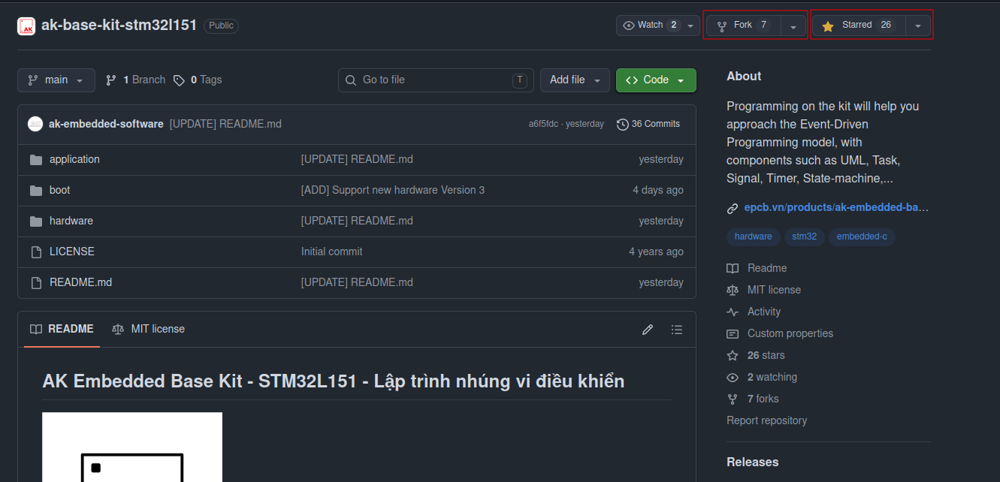
</p>

### 3. Tạo bản fork

<p align="center">
  
</p>

> **Note:**
> - Đặt tên repository chính là **tên game** của bạn.
> - Mô tả ngắn gọn về game trong phần **Description**.

Sau khi fork thành công, GitHub sẽ chuyển đến repository mới — đây chính là "bộ khung" để bạn phát triển và hoàn thiện game:

<p align="center">
  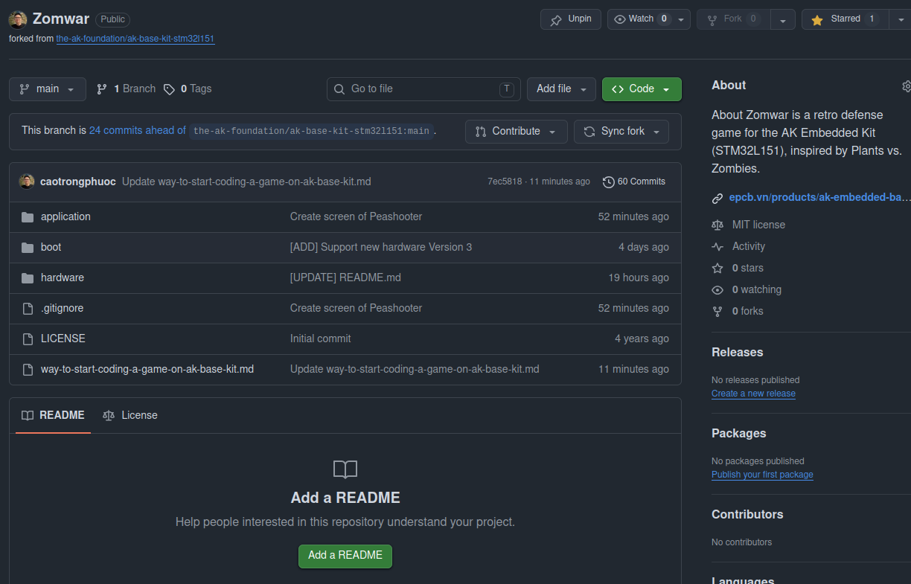
</p>

---

## II. Quickstartguide (Setup môi trường)

Để build source code và nạp firmware lên kit, bạn cần cài đặt môi trường phát triển trên Ubuntu/Linux. Hướng dẫn chi tiết từng bước có tại đây:

**[AK Embedded Base Kit STM32L151 — Getting Started](https://epcb.vn/blogs/ak-embedded-software/ak-embedded-base-kit-stm32l151-getting-started)**

---

## III. Quy trình lập trình game

> **Note:** Vì đây là dự án phần mềm nhúng, bạn nên sử dụng **Terminal trên môi trường Ubuntu/Linux** để đảm bảo quá trình build và nạp firmware diễn ra chính xác.

### Bước 1: Tạo thư mục làm việc

Từ thư mục `Home`, tạo một thư mục đặt tên là **Workspace** — đây sẽ là nơi chứa toàn bộ source code và công cụ lập trình.

<p align="center">
  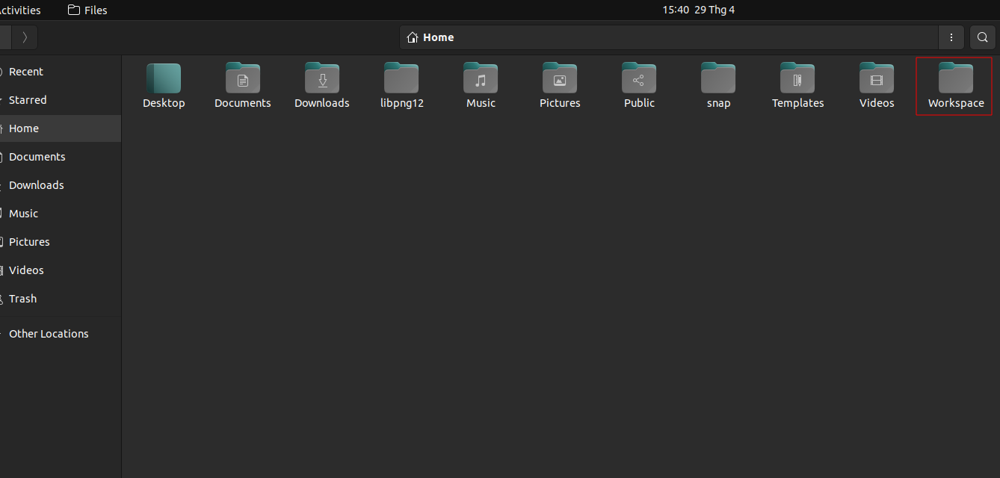
</p>

Bên trong `Workspace`, tạo thêm 2 thư mục con:

| Thư mục   | Mục đích                                                                                       |
| --------- | ---------------------------------------------------------------------------------------------- |
| `Sources` | Chứa các dự án lập trình của bạn                                                               |
| `Tools`   | Chứa các công cụ lập trình (xem chi tiết tại [phần II](#ii-quick-start-guide-setup-môi-trường)) |

<p align="center">
  
</p>

---

### Bước 2: Clone repo về máy

> **Note:** Bước này chỉ cần thực hiện **một lần duy nhất** khi bắt đầu dự án.

Mở **Terminal** ngay tại thư mục `Sources` và chạy lệnh sau (nhớ thay bằng link repo của bạn):

```bash
git clone https://github.com/<ten-cua-ban>/<ten-repo-da-clone>.git
```

<p align="center">
  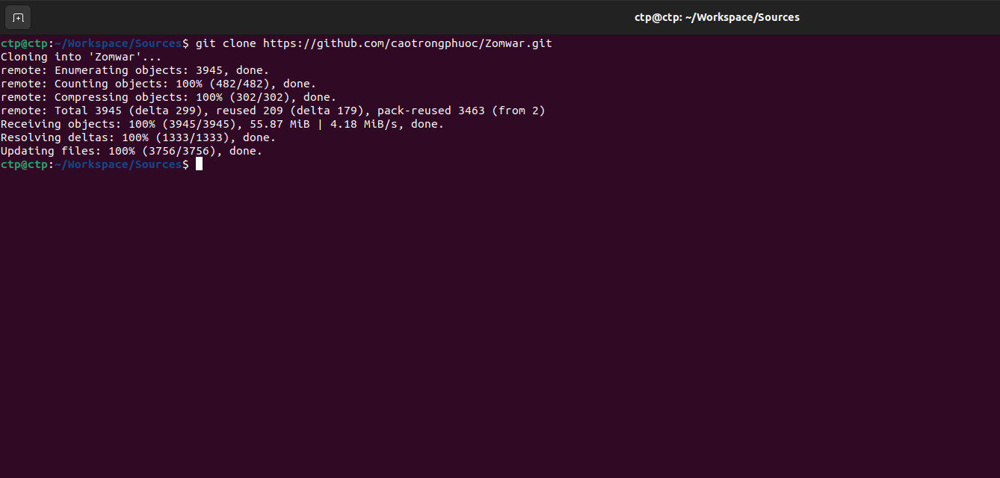
</p>

---

### Bước 3: Modify Game

Mở **VSCode** trên Linux, sau đó mở repository vừa clone để bắt đầu lập trình.

Trước tiên, hãy đặt tên cho game của bạn trong file `Makefile.mk` ở thư mục `application/`:

<p align="center">
  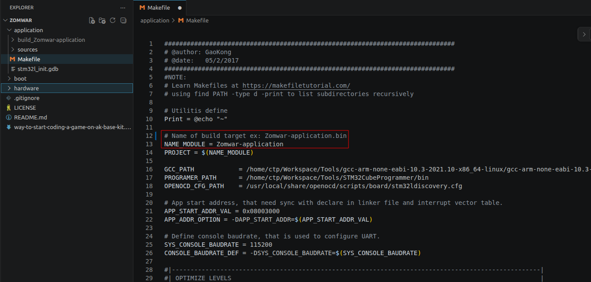
</p>

Toàn bộ logic game được viết trong thư mục `application/sources/app`.

<p align="center">
  
</p>

#### Ví dụ: Hiển thị màn hình Peashooter (Cây đậu bắn súng) trong game Plants vs. Zombies

**Bước 3.1 —** Tạo file header `scr_peashooter.h` trong thư mục `screens/` để khai báo các hàm vẽ màn hình Peashooter:

<p align="center">
  
</p>

**Bước 3.2 —** Tạo file `scr_peashooter.cpp` để xử lý dữ liệu bitmap và hiển thị Peashooter lên màn hình:

<p align="center">
  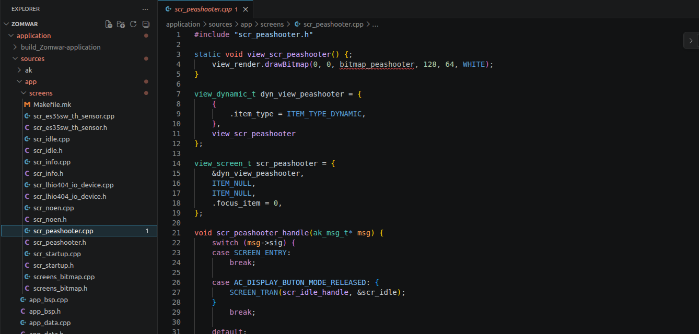
</p>

**Bước 3.3 —** Tạo file header `screens_bitmap.h` trong thư mục `screens/` để khai báo dữ liệu bitmap dùng chung:

<p align="center">
  
</p>

**Bước 3.4 —** Tạo file `screens_bitmap.cpp` chứa dữ liệu bitmap của Peashooter:

<p align="center">
  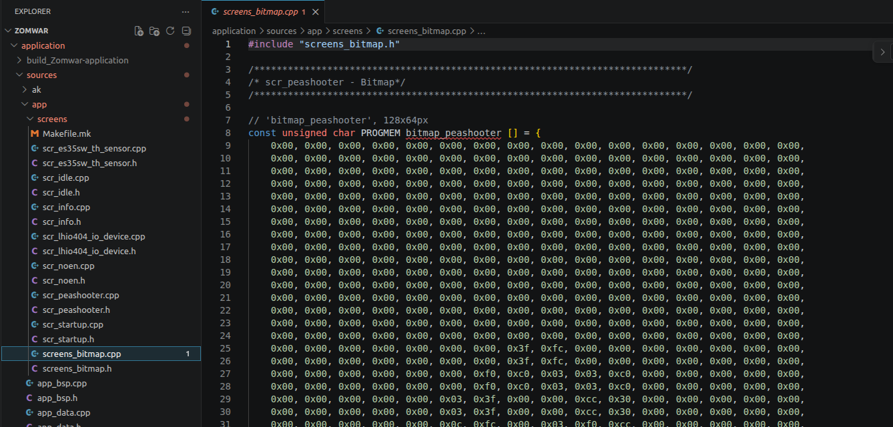
</p>

**Bước 3.5 —** Include file header của Peashooter vào `task_display.h`:

<p align="center">
  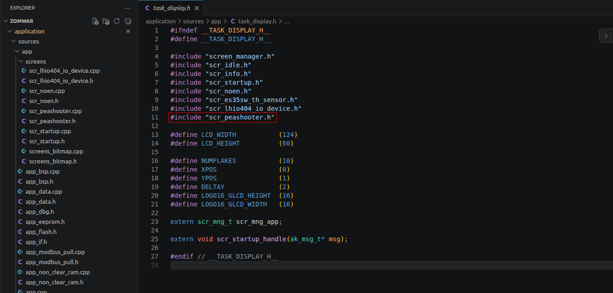
</p>

**Bước 3.6 —** Cập nhật lại case `AC_DISPLAY_BUTTON_MODE_RELEASED`:

<p align="center">
  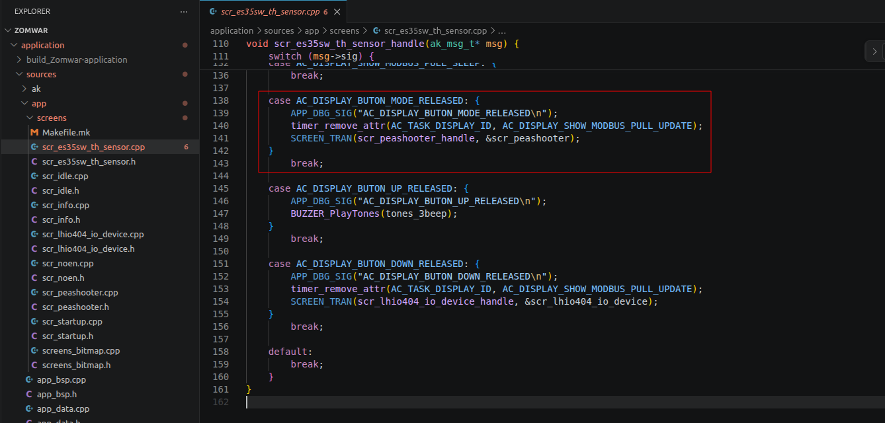
</p>

**Bước 3.7 —** Thêm hai file `scr_peashooter.cpp` và `screens_bitmap.cpp` vào `Makefile.mk` trong thư mục `screens/` để biên dịch:

<p align="center">
  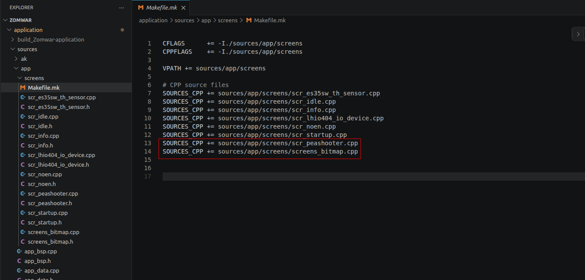
</p>

**Bước 3.8 —** Build và nạp firmware lên kit (xem hướng dẫn chi tiết tại [phần II](#ii-quick-start-guide-setup-môi-trường)):

<p align="center">
  
</p>

---

### Bước 4: Push code lên GitHub

Sau khi hoàn thành một tính năng, hãy lưu lại tiến độ lên repo cá nhân bằng các lệnh sau (chạy tại **thư mục gốc** của repo):

```bash
git add .
git commit -m "Create screen of Peashooter"
git push origin main
```

**Kết quả sau khi chạy lệnh:**

<p align="center">
  
</p>

**Repository đã được cập nhật trên GitHub:**

<p align="center">
  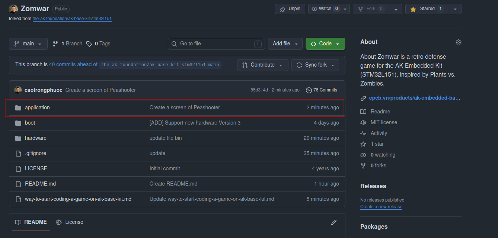
</p>

<p align="center">
  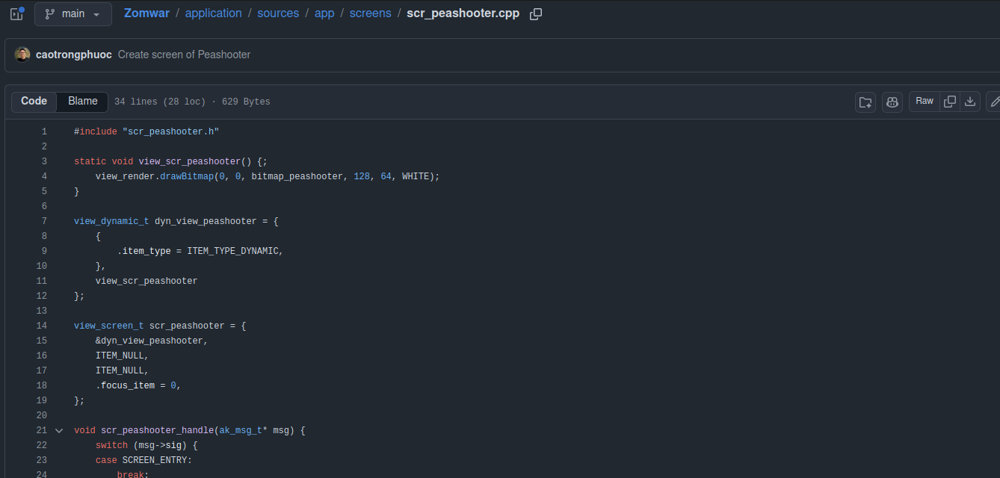
</p>

Từ đây, bất kỳ ai cũng có thể truy cập link GitHub của bạn để theo dõi tiến độ và trải nghiệm tựa game mà bạn đã tạo ra.

---

## Liên hệ & Hỗ trợ

- LinkedIn: [www.linkedin.com/in/cao-trong-phuoc](https://www.linkedin.com/in/cao-trong-phuoc)
- Dép lào: 0936310918

## Tài liệu tham khảo

- Blog: [AK Embedded Software](https://epcb.vn/blogs/ak-embedded-software)

---

<p align="center">
  <i>Chúc bạn lập trình vui vẻ và tạo ra những tựa game thật thú vị!</i>
</p>
